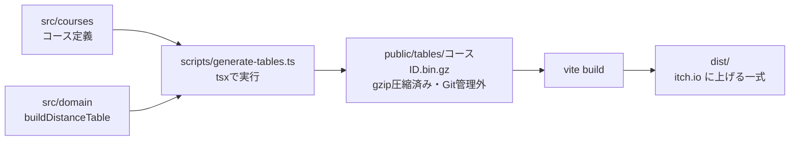

# 技術仕様書 (Architecture Design Document)

このドキュメントは、`docs/product-requirements.md`(PRD)と `docs/functional-design.md`(機能設計書)を実現するための技術構成を定める。機能設計書で「`architecture.md` で定める」とした項目(ビルドツール、盤の大きさ、表の計算の高速化、E2Eテストのツールなど)も、ここで決める。

## テクノロジースタック

### 言語・ランタイム

| 技術 | バージョン | 選定理由 |
|------|-----------|----------|
| TypeScript | 5.9.x | 座標・状態・行動を型で表し、ルールの実装ミスをコンパイル時に見つける。プロジェクトの方針(CLAUDE.md)で5.xとしている。7.x(Go実装)は、typescript-eslint が対応していない(`<6.1.0`)ため採用しない |
| Node.js | v24 LTS(devcontainerは `lts` を指定。パッチ番号は固定しない) | 開発時のビルド・テスト・表の生成にだけ使う。遊ぶときには使わない |
| npm | 11.x | Node.js に同梱。`package-lock.json` で依存を固定する |
| 実行環境(遊ぶとき) | ブラウザ | PRDの対応環境: PCの最新版 Chrome / Edge / Firefox / Safari、スマホの iOS Safari・Android Chrome の最新版 |

### フレームワーク・ライブラリ

実行時に読み込むライブラリは使わない(依存ゼロ)。

| 技術 | 用途 | 選定理由 |
|------|------|----------|
| DOM API + SVG | 画面と盤の描画 | 盤の要素は数百個で、フレームワークの状態管理がなくても十分扱える。SVGは拡大してもくっきりし、CSS変数で色を切り替えられる。依存を増やさず、読み込みも軽くなる |
| CSS(CSS変数・メディアクエリ) | レイアウトと配色 | 画面幅によるレイアウトの切り替え、P1のダークモード、prefers-reduced-motion への対応を、CSSだけで実現できる |

### 開発ツール

| 技術 | バージョン | 用途 | 選定理由 |
|------|-----------|------|----------|
| Vite | 8.x | 開発サーバーとビルド | TypeScriptをそのまま扱え、静的ファイル(HTML・JS・CSS)を出力できる。`base: './'` で相対パスにでき、itch.io の配信先のパスに依存しない |
| tsx | 最新安定版 | ビルド前スクリプトの実行 | 最短手数の表を生成するスクリプトを、ドメイン層のTypeScriptのコードのまま Node.js で動かすため |
| Vitest | 5.x | ユニットテスト・シミュレーション | Vite と設定を共有できる。リポジトリで準備済み |
| @vitest/coverage-v8 | 5.x | カバレッジ計測 | リポジトリで準備済み |
| @vitest/ui | 5.x | テスト結果をブラウザで見る(`npm run test:ui`) | リポジトリで準備済み |
| @types/node | 24.x | 表の生成スクリプトとテストで使う Node.js の型 | Node.js v24 に合わせる |
| Playwright | 1.63.x | E2Eテスト | Chromium と WebKit(iOS Safari 相当)の両方で、スマホの画面幅とタッチ操作を再現できる |
| ESLint + typescript-eslint | 9.x / 8.x | 静的解析 | リポジトリで準備済み。層の依存ルールの強制にも使う(後述) |
| Prettier | 3.x | 整形 | リポジトリで準備済み |
| husky + lint-staged | 9.x / 15.x | コミット前チェック | リポジトリで準備済み。コミット前に lint・整形・型チェックを行う |

## アーキテクチャパターン

### レイヤードアーキテクチャ

機能設計書の構成(UI層・アプリケーション層・ドメイン層)を、次の依存方向で実装する。

```
┌──────────────────────────────┐
│   UI層 (src/ui)               │ ← 画面・盤の描画、入力の受付
├──────────────────────────────┤
│   アプリケーション層 (src/app)  │ ← 画面の流れ、手番の進行、CPUの手番の演出
├──────────────────────────────┤
│   ドメイン層 (src/domain)       │ ← ルール、コースの判定、最短手数の表、CPUの手の選択
└──────────────────────────────┘
        ↑
   コース定義 (src/courses) … ドメイン層の型で書いたデータ
```

依存は上から下への一方向だけにする。

```
UI → アプリケーション → ドメイン   (OK)
UI → ドメイン(型と純粋関数の参照)  (OK)
ドメイン → アプリケーション / UI     (NG)
ドメイン → DOM・ブラウザAPI         (NG)
```

#### UI層(`src/ui`)
- **責務**: 画面(設定・レース・結果・ダイアログ)と盤(SVG)の描画、入力(クリック・タップ・方向パッド)の受付、プレビューと確定の2段階の管理
- **許可される操作**: アプリケーション層の呼び出し、ドメイン層の型と純粋関数の参照(例: 座標の計算)
- **禁止される操作**: ゲームの状態を直接書き換えること(状態の変更は必ずアプリケーション層を通す)

#### アプリケーション層(`src/app`)
- **責務**: `GameController`。画面の遷移、ドメイン層の呼び出し、CPUの「考え中」やアニメーションの待ち合わせ、P1の「1手戻す」の履歴
- **許可される操作**: ドメイン層の呼び出し、`GameView` インターフェースを通したUI層の呼び出し
- **禁止される操作**: ルールの判定を自前で行うこと(判定は必ずドメイン層に任せる)

#### ドメイン層(`src/domain`)
- **責務**: `Course`・`Rules`・`DistanceTable`・`CpuPlayer`。機能設計書のアルゴリズムの実装
- **許可される操作**: 純粋な計算だけ
- **禁止される操作**: DOM・`window`・`document`・タイマー・`Math.random` の直接使用(乱数は `Random` インターフェースで受け取る)
- ドメイン層はブラウザとNode.jsの両方で動く。これにより、同じコードをユニットテスト、シミュレーション、ビルド時の表の生成、ブラウザで使える

### 層のルールの強制

- ESLint の `no-restricted-imports` で、`src/domain` から `src/app`・`src/ui` への import を禁止する
- ESLint の `no-restricted-globals` で、`src/domain` での `window`・`document`・`setTimeout`・`requestAnimationFrame` の使用を禁止し、`no-restricted-properties` で `Math.random` を禁止する

## 盤の大きさと速度の範囲

機能設計書で `architecture.md` に委ねた数値を、次のとおり決める。

| 項目 | 値 | 根拠 |
|------|-----|------|
| 盤の格子点 | 0〜32(33×33) | 幅360pxの画面で、左右の余白を差し引いた約328pxに32目盛りが入り、1目盛り約10pxになる。盤全体を横スクロールなしで表示できる(PRDの受け入れ条件)。細かい点のタップは方向パッドで補う |
| 速度の範囲(各成分) | −7〜+7 | 速度0から1目盛りずつしか加速できないので、速度 k に達するまでに同じ向きに `1 + 2 + … + k = k(k+1)/2` 目盛り進む必要がある。盤の中に収まるのは `k(k+1)/2 ≤ 32` の k ≤ 7 まで。速度8以上になる手は必ず盤の外に出るので、表に載せる必要がない(ゴールする最後の1手の後は状態を持たない) |
| 表の状態の数 | 33 × 33 × 15 × 15 = 245,025 | 位置 × 速度。1状態1バイト(最短手数 0〜254、255 を「なし」)で、1コース約240KB(圧縮前)。大半が「なし」のため、gzip で圧縮すると約9KBになる(試作での計測) |

- 速度の範囲は、盤の大きさ `N` から `k(k+1)/2 ≤ N − 1` を満たす最大の k として計算で求める。盤の大きさを変えれば自動で追従する
- 「コース内で出せる速度がすべて範囲に入る」ことは、自動テストで確認する(PRDの非機能要件)

## 最短手数の表の用意

### 方式: ビルド時に生成して同梱する

コースは固定の3つなので、最短手数の表はビルド時に計算し、バイナリファイルとして同梱する。ブラウザでは読み込むだけにする。



- `npm run build` と `npm run dev` の前に、`scripts/generate-tables.ts` が自動で走る(`prebuild`・`predev`)
- 表は gzip で圧縮して `public/tables/[コースID].bin.gz` に書き出す。生成物は Git で管理しない。毎回のビルドで、その時点のルールとコース定義から作り直すので、表と判定がずれない
- ブラウザでは、レース開始前の「コースの準備」で、選んだコースの表を相対パスで読み込み、ブラウザ標準の `DecompressionStream('gzip')` で展開する(同じ配信元からの読み込みで、外部通信ではない。追加のライブラリは使わない)。一度読み込んだ表は、ページを開いている間は使い回す
- 配信サーバーの圧縮設定に頼らず、ファイル自体を圧縮しておくことで、配信サイズと転送量の両方を小さく保つ

### 採用の理由(試作での計測)

計算方式を決めるため、うずまきに近い形の試作コース(盤 0〜32、半幅2)で、機能設計書の後ろ向き幅優先探索を試作して計測した(開発用コンテナ、Node.js v24)。

| 実装 | 計算時間 | 備考 |
|------|----------|------|
| 線分を1/16目盛り間隔ですべて標本化 | 約0.7秒 | 判定の回数は約9万回 |
| 標本化を後述の「距離による省略」で減らす | 約0.35秒 | 同上。ただし、この試作は省略の上限の式を誤っていた(実装時に修正)。正しい式では省略できる部分が減るため、表の生成を実装する作業で計測し直す |

- スマホのCPUは開発機より遅い(E2Eテストでは、Chrome DevTools の CPU 4倍スローダウンをスマホの目安とする)。0.35秒の4倍は約1.4秒で、ブラウザで計算するとPRDの「コースの準備 最大1秒以内」を満たせない恐れがある
- ビルド時に生成すれば、ブラウザでの準備は表(圧縮後約9KB)の読み込みと展開だけになり、端末の性能に左右されない

### 却下した案

| 案 | 却下の理由 |
|----|-----------|
| ブラウザで毎回計算する | 上記のとおり、スマホで1秒を超える恐れがある |
| Web Worker でバックグラウンド計算する | 画面は固まらないが、準備にかかる時間そのものは縮まらない。将来、ランダム生成やエディタ(P2)で固定でないコースを扱うときに採用する |

### 将来(P2)への備え
- `buildDistanceTable` はドメイン層の純粋関数なので、固定でないコースを扱うときは、同じ関数を Web Worker で動かせばよい

## 線分の内外判定の実装

機能設計書のアルゴリズム(1/16目盛りの標本化、ずれ最大1/32目盛り)を、次の方法で速くする。判定結果は、すべての標本点を調べた場合と同じ精度になる。

### 距離による省略(二分割)
- 点から中心線(パス)までの距離 `d` は、点を1目盛り動かしても1目盛りまでしか変わらない
- そのため、長さ `L` の線分の両端の距離を `da`・`db` とすると、端 a から `s` の位置の点の距離は `min(da + s, db + L − s)` 以下で、線分上のすべての点の距離は `(da + db + L) / 2` 以下になる
- `(da + db + L) / 2 ≤ 半幅` なら、線分全体が内側と確定し、それ以上調べない
- 確定しなければ、線分の中点の距離を調べ、外側ならはみ出し、内側なら二つに分けて同じことを繰り返す
- 分けた線分の長さが1/16目盛り以下になったら、内側とみなす(このときのずれは最大1/32目盛り)

### 端の切り落とし
- 上の距離は、スタートとゴールの端を丸めたコースの距離になる。スタートラインの後ろとゴールラインの先を平らに切り落とすため、端の要素(最初と最後の直線)の範囲外で、端の丸めの部分にある点は外側とする(機能設計書のステップ2の判定と同じ結果になる)

### 表の生成でのくふう
- 後ろ向き探索で、ある状態 `(p, v)` から前の9状態をたどるとき、線分 `p − v → p` は9つとも同じなので、線分の判定は1回だけ行う
- 1手でゴールできる状態を集めるときは、ゴールラインに届く可能性のある状態(移動先がゴールラインを越える向きのもの)だけを調べる

## 画面レイアウトの切り替え

機能設計書で委ねられた、PC(盤と操作パネルの横並び)とスマホ(縦並び)を切り替える条件を、次のとおり決める。

| 条件(CSSメディアクエリ) | レイアウト |
|------|------|
| `(min-width: 768px) and (orientation: landscape)` | 横並び(PC、横向きのタブレット) |
| 上記以外 | 縦並び(スマホ、縦向きのタブレット) |

- 盤は、使える幅と高さの小さい方に合わせて正方形で表示する。幅360pxでは、左右の余白16pxずつを除いた約328pxになる
- 切り替えはCSSだけで行い、TypeScript では画面幅を調べない

## データ永続化戦略

### ストレージ方式

最初の版では、データを保存しない(PRDのスコープ外)。

| データ種別 | 置き場所 | フォーマット | 理由 |
|-----------|----------|-------------|------|
| コース定義 | ソースコード(`src/courses`) | TypeScript のオブジェクト | 固定の3コース。型チェックが効く |
| 最短手数の表 | ビルド生成物(`public/tables`) | バイナリ(1状態1バイト)を gzip で圧縮 | 上記「最短手数の表の用意」 |
| 設定 | メモリのみ | — | 保存しない。ページを開き直すとデフォルトに戻る |
| ゲームの状態・履歴 | メモリのみ | — | 保存しない |

### バックアップ戦略

保存するデータがないため、バックアップは不要。ソースコードは Git で管理する。

## パフォーマンス要件

### レスポンスタイム

PRDの非機能要件(パフォーマンス)の各項目を、次の方法で測る。目標値は PRD を正とし、ここには書かない。

| 項目(PRD) | 測定方法 |
|------|---------|
| コースの準備 | E2Eテスト(Chromium)で、CPU 4倍スローダウン(スマホの目安)をかけ、「スタート」押下からスタート位置選びの表示までを計測 |
| CPUの手の計算 | シミュレーションで `chooseMove` の最大時間を計測 |
| 候補の表示 | E2Eテストで、手番が移ってから候補が表示されるまでを計測 |
| 車の移動アニメーション | Web Animations API(または `requestAnimationFrame`)で描画し、時間はアプリケーション層の定数で管理する。なめらかさは手動で確認 |
| 初回表示 | E2Eテスト(Chromium)で、回線を下り1.6Mbps・遅延150ms(Chrome DevTools の「Fast 3G」相当)に絞り、ページを開いてから設定画面が操作できるまでを計測する。あわせて、CIで配信サイズの上限(下の「リソース使用量」)を確認する |

PRDにない、このドキュメントで決める目標は次のとおり。

| 項目 | 目標 | 測定方法 |
|------|------|---------|
| 表の生成(ビルド時) | 1コース2秒以内 | 生成スクリプトでコースごとに計測して表示(ビルドが遅くなりすぎないための目安) |

### 描画の工夫

- 盤のSVGを、変わらない層(芝・方眼・コース・スタートライン・ゴールライン)と、手番ごとに変わる層(軌跡・車・候補・プレビュー)に分ける。変わらない層は、コースを選んだときに1回だけ描く
- 手番ごとに描き直すのは、変わる層だけにする

### リソース使用量

| リソース | 上限 | 理由 | 測定方法 |
|---------|------|------|---------|
| 配信サイズ | `dist/` の合計 500KB 以内(表3つは gzip 圧縮済みで合計約30KB) | 初回表示3秒以内のため。Fast 3G 相当(1.6Mbps)でも500KBは約2.5秒で届く | CIの build ジョブで `scripts/check-dist-size.ts` が合計を計算し、超えたら失敗させる |
| メモリ(JSヒープ) | 20MB 以内 | 展開した表は1コース約240KB(使うのは選んだ1コースだけ)、盤のSVG要素は千程度で、合わせても数MB。ブラウザごとの差を見込んで余裕を持たせた | 公開前に Chrome DevTools の Memory パネルで、1レース後のJSヒープサイズを手動で確認する |

## デプロイ(itch.io)

| 項目 | 設定 |
|------|------|
| 種類 | HTML5 ゲーム(「This file will be played in the browser」) |
| アップロードするもの | `dist/` の中身を zip にしたもの(zip の直下に `index.html`) |
| パス | Vite の `base: './'` で、すべてのファイルを相対パスで参照する |
| 埋め込みサイズ | PC向けに 960 × 720 を目安とし、全画面ボタンを有効にする |
| スマホ | 「Mobile friendly」を有効にする |
| アップロード方法 | 最初は手動。慣れてきたら itch.io の公式ツール butler で自動化を検討する(その場合、APIキーはリポジトリに置かず、CI の秘密情報として管理する) |
| 切り戻し | 公開後に不具合が見つかったら、直前のバージョンのタグをチェックアウトしてビルドし直し、再アップロードする |

## セキュリティアーキテクチャ

### データ保護

- **暗号化**: 保存・送信するデータがないため不要
- **アクセス制御**: 不要(静的ファイルのみ)
- **機密情報管理**: 最初の版には秘密情報がない。butler で自動化する場合の APIキーは、CI の秘密情報に置き、リポジトリや配信物に含めない

### 外部通信

- 外部サーバーとは通信しない。読み込むのは、同じ配信元にある自分のファイル(HTML・JS・CSS・表)だけ
- 外部のスクリプト、フォント、トラッキングは読み込まない

### 入力検証

- **行動の検証**: ドメイン層の `applyAction` は、行動(スタート位置、加速)がルールに合うかを必ず検証し、合わなければ例外を投げて状態を変えない(機能設計書のエラーハンドリング)。将来のオンライン対戦で相手から届く行動も、同じ検証を通す
- **表の検証**: 読み込んだ表のサイズが、コースの盤の大きさと速度の範囲から計算したサイズと一致するかを確認する。一致しなければ、エラーとして設定画面に戻る
- **文字列の表示**: 画面に出す文字列はすべて固定の文言で、利用者の入力をHTMLとして挿入しない(`innerHTML` にユーザー由来の文字列を渡さない)

## スケーラビリティ設計

### データ増加への対応

- **想定データ量**: 固定3コース、1レースあたり数十手
- 1レースの履歴(P1の「1手戻す」)は、状態を数十個積むだけなので、対策は不要

### 機能拡張性

| 将来の機能(PRD) | 今の設計での備え |
|------|------|
| 3台以上のレース(12) | `GameState.players` は配列で、人数を固定しない。色は `PenColor` に色を足す。同着・行き止まりの扱いは、決着の判定を `Rules` の1か所にまとめておき、そこを拡張する |
| オンライン対戦(11) | 行動(`Action`)は座標だけの小さな値で、そのまま送れる。ドメイン層が行動を検証するので、相手から届いた行動も安全に適用できる。同期サービス(Firebase など)との接続は、アプリケーション層に新しい入力元として追加する |
| コースの追加(13) | コース定義を `src/courses` に足せば、表はビルド時に自動で生成される |
| ランダム生成・エディタ(13) | `buildDistanceTable` を Web Worker で実行する |
| ダークモード(P1) | 色はすべてCSS変数で定義し、変数の値だけを切り替える |

## テスト戦略

### ユニットテスト
- **フレームワーク**: Vitest(実行環境は Node.js)
- **対象**: ドメイン層のすべて(機能設計書のテスト戦略の「ユニットテスト」)
- **カバレッジ目標**: ドメイン層で、行・分岐・関数それぞれ80%以上(リポジトリの既存設定を、ドメイン層に絞って適用する)

### コースの自動チェック
- **フレームワーク**: Vitest
- **対象**: 機能設計書の「コースの自動チェック」(芝の幅、スタート位置の最短手数、盤に収まること、速度の範囲)

### シミュレーション
- **フレームワーク**: Vitest(通常のテストとは別のコマンド `npm run test:sim` で実行する。時間がかかるため)
- **対象**: PRDのKPI「CPUの行き詰まりゼロ」の条件(対戦の組み合わせとレース数)でのCPU同士の対戦。乱数は種(シード)を固定できる疑似乱数を使い、失敗したレースを再現できるようにする
- **実行のタイミング**: CPUやルール、コースを変えたとき、および公開前

### E2Eテスト
- **ツール**: Playwright(Chromium と WebKit)
- **対象**: ビルドした `dist/` を静的サーバーで配信して動かす
- **シナリオ**: 機能設計書の「E2Eテスト」(一連の流れ、スマホ幅360pxでの表示と方向パッド、設定に戻る確認)。スマホ幅ではタッチ操作(`hasTouch`)を有効にする
- **CPUの乱数**: テスト用に乱数の種をURLのパラメータで固定できるようにし、結果を再現できるようにする(本番の画面にはこの指定の手段を出さない)

## 技術的制約

### 環境要件
- **遊ぶ環境**: PRDの対応環境のブラウザ。JavaScript が有効であること
- **画面**: 幅360px以上
- **開発環境**: devcontainer(Node.js LTS)。Playwright のブラウザは devcontainer 内にインストールする

### パフォーマンス制約
- ブラウザでは重い計算をしない(表はビルド時に生成する)
- CPUの手の選択は、表を9回引くだけの処理に保つ

### セキュリティ制約
- 実行時の外部通信・外部スクリプトを使わない
- 秘密情報をリポジトリと配信物に含めない

## 依存関係管理

実行時の依存(`dependencies`)はなし。すべて開発時の依存(`devDependencies`)とする。

| ライブラリ | 用途 | バージョン管理方針 |
|-----------|------|-------------------|
| typescript | 型チェック・コンパイル | `~5.9.0`(パッチのみ自動)。メジャーの更新は typescript-eslint の対応を待つ |
| vite | 開発サーバー・ビルド | `^8.x`(マイナーまで自動) |
| vitest / @vitest/coverage-v8 / @vitest/ui | テスト | `^5.x`。3つのバージョンをそろえる |
| @types/node | Node.js の型 | `^24.x`。Node.js のメジャーバージョンに合わせる |
| @playwright/test | E2Eテスト | `^1.63.x` |
| tsx | 表の生成スクリプトの実行 | `^` の最新安定版 |
| eslint / typescript-eslint / prettier / husky / lint-staged | 静的解析・整形・コミット前チェック | 既存の指定を維持 |

- `package-lock.json` をコミットし、全員が同じバージョンを使う

### 現在のリポジトリ設定からの変更点

実装の最初の作業(`.steering/` の最初の作業)で、次を変更する。

| 対象 | 現状 | 変更後 |
|------|------|--------|
| `package.json` の scripts | `build: tsc` など、Node.js 向けの構成 | 下の「npm scripts」のとおり |
| `package.json` の devDependencies | typescript `~5.3.0`、vitest 系 `^2.0.0`、@types/node `^20.11.0` | 「依存関係管理」の表のバージョンに更新。vite・tsx・@playwright/test を追加 |
| `tsconfig.json` | `lib: ["ES2022"]`(DOMなし)、`rootDir: "./src"`、`include: ["src/**/*"]`、`outDir: "./dist"` | `lib: ["ES2022", "DOM", "DOM.Iterable"]`、`rootDir` と `outDir` を削除し `noEmit: true`(出力は Vite が行う)、`include: ["src/**/*", "scripts/**/*", "tests/**/*"]` |
| `vitest.config.ts` | `tests/**/*.{test,spec}.{ts,tsx}` をすべて対象にし、カバレッジの閾値を全体に適用 | 対象から `tests/e2e/**`(Playwright のテスト)と `**/*.sim.test.ts`(シミュレーション)を除外。カバレッジの対象を `src/domain/**` に絞る。シミュレーション用に `vitest.sim.config.ts` を追加し、`tests/sim/**` だけを対象にする |
| `eslint.config.js` | 層のルールなし、`no-explicit-any` は警告 | 「層のルールの強制」のルールを `src/domain/**`・`src/app/**`・`src/courses/**`・`scripts/**` ごとに追加。`@typescript-eslint/no-explicit-any` を `error` にし、`no-restricted-syntax` で `enum` の宣言を禁止する |
| `.gitignore`・`.prettierignore` | — | `public/tables/`、`test-results/`、`playwright-report/` を追加 |
| `.github/workflows/ci.yml` | なし | 開発ガイドラインの「CI」のジョブを追加 |
| `src/example.ts` など | テンプレートのサンプル | 削除する |

### npm scripts

| スクリプト | コマンド |
|-----------|---------|
| `gen:tables` | `tsx scripts/generate-tables.ts` |
| `predev` | `npm run gen:tables` |
| `dev` | `vite` |
| `prebuild` | `npm run gen:tables` |
| `build` | `tsc --noEmit && vite build` |
| `preview` | `vite preview` |
| `check:size` | `tsx scripts/check-dist-size.ts` |
| `lint` | `eslint .` |
| `typecheck` | `tsc --noEmit` |
| `test` | `vitest run` |
| `test:watch` | `vitest` |
| `test:coverage` | `vitest run --coverage` |
| `test:ui` | `vitest --ui` |
| `test:sim` | `vitest run --config vitest.sim.config.ts` |
| `test:e2e` | `npm run build && playwright test` |
