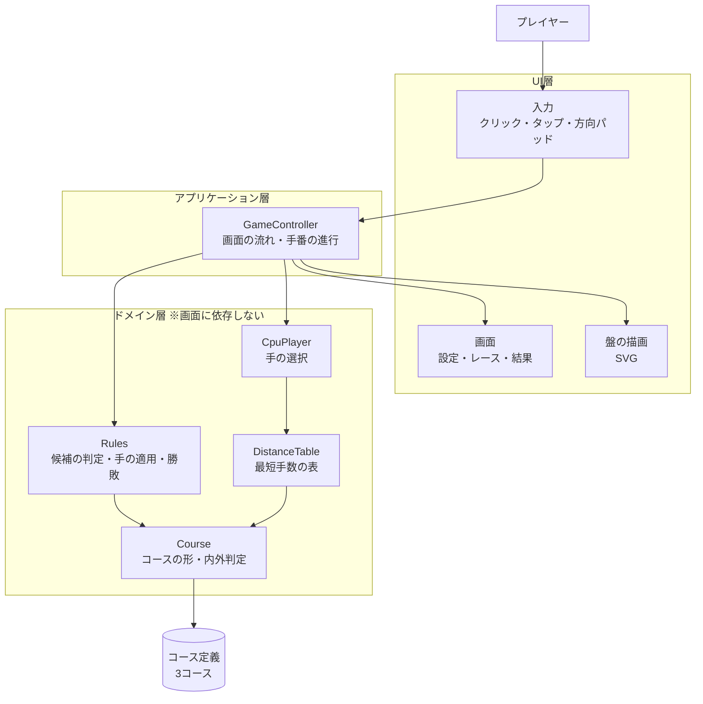
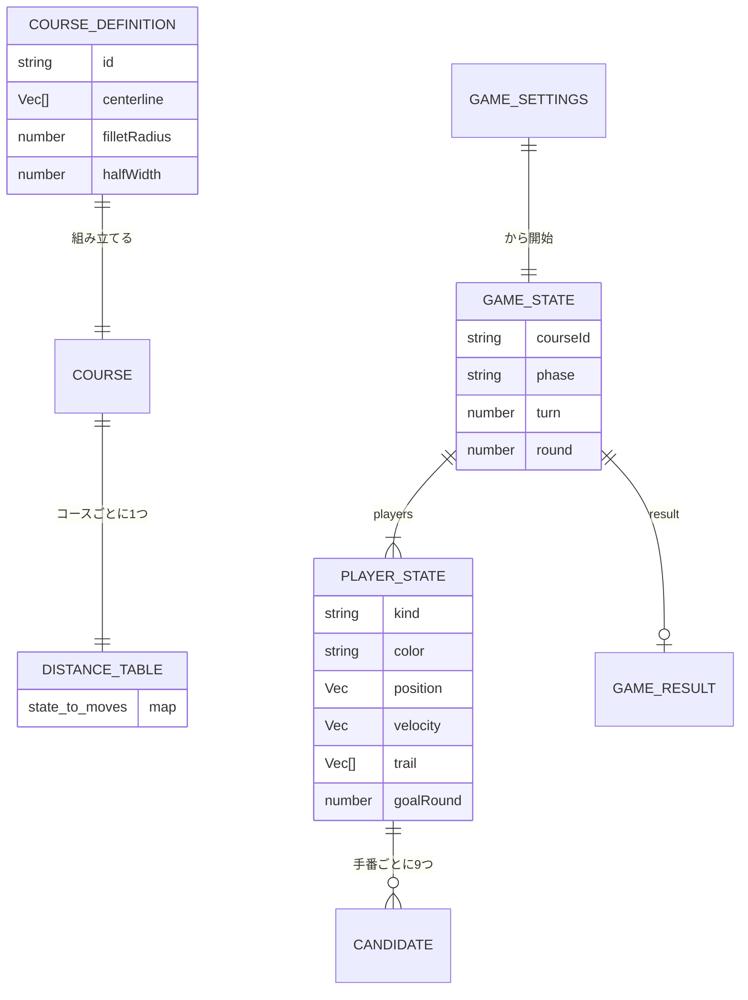
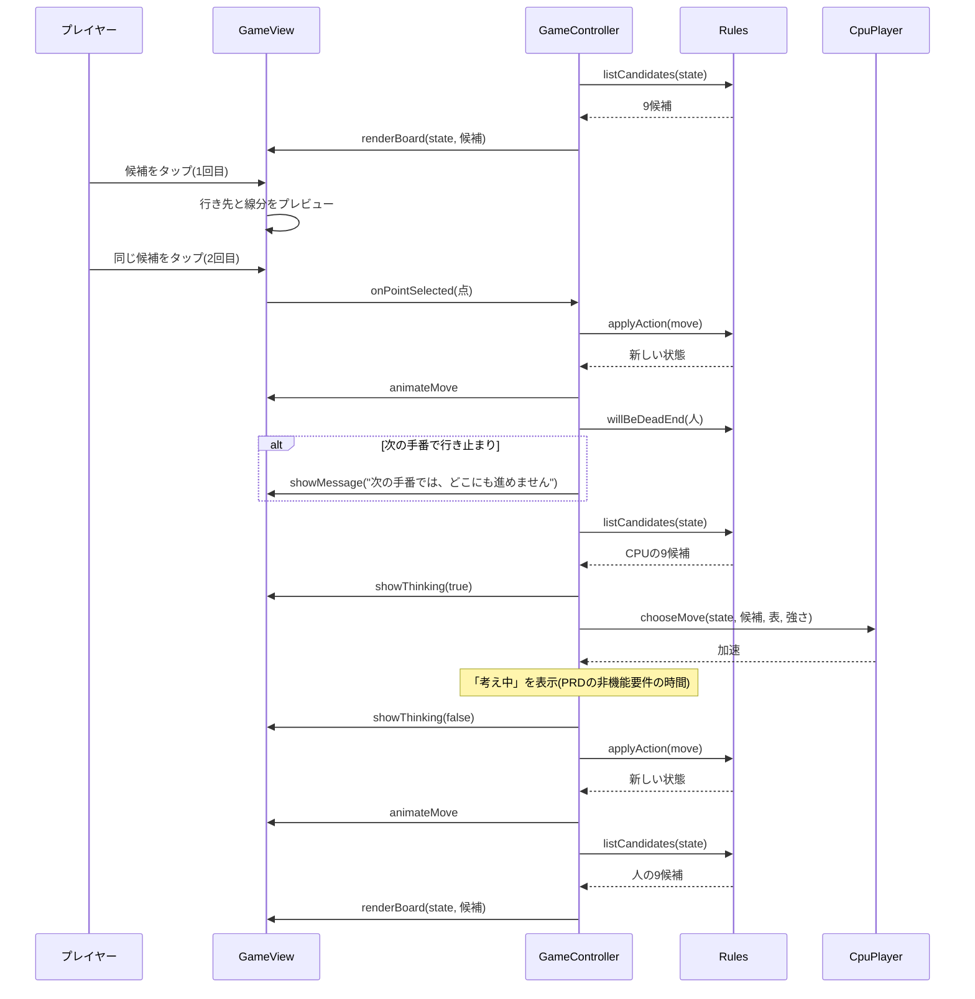
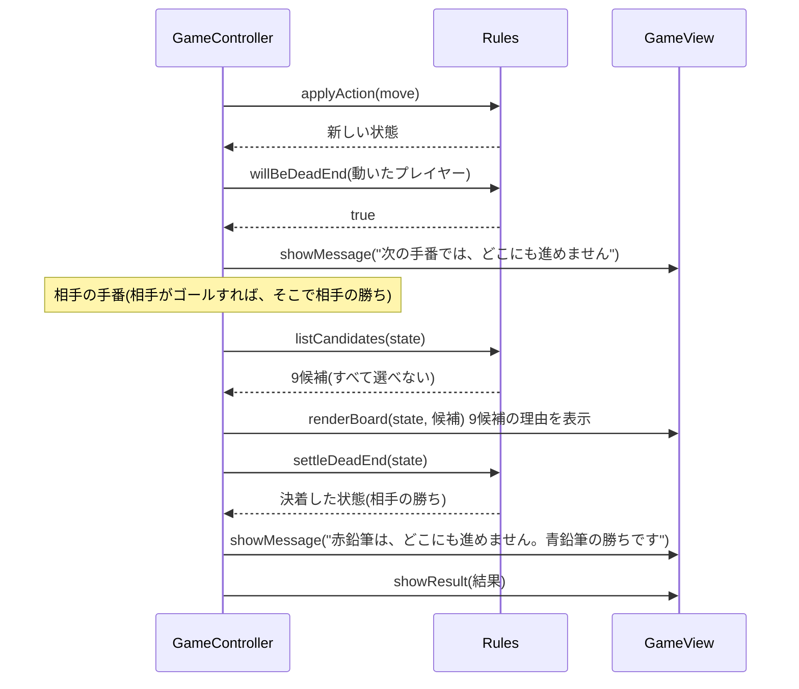
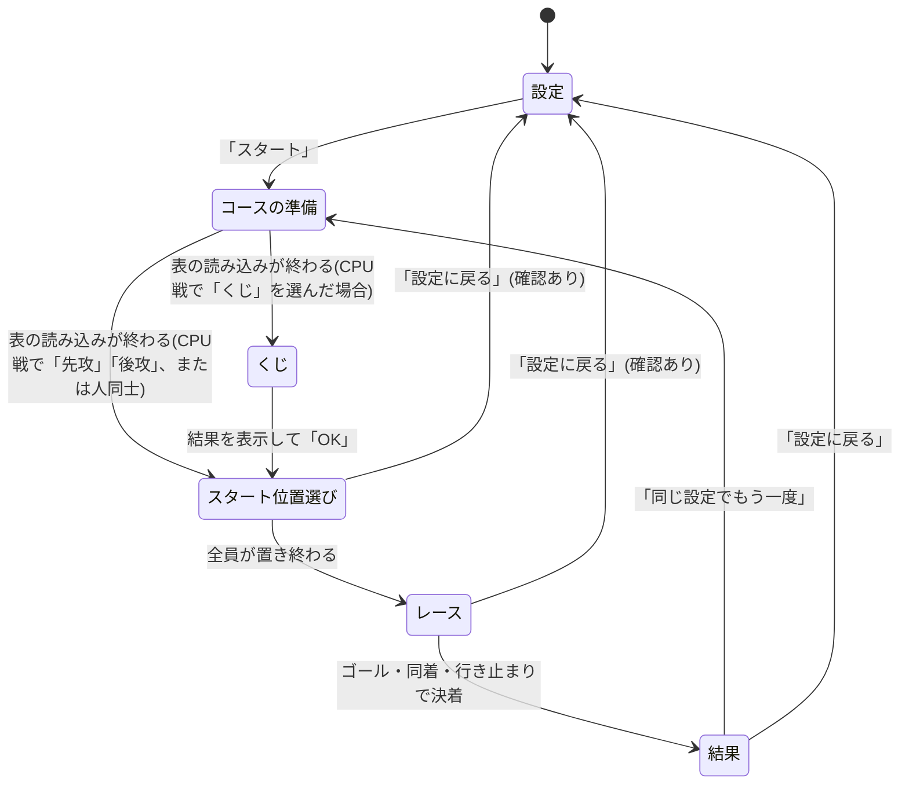

# 機能設計書 (Functional Design Document)

このドキュメントは、`docs/product-requirements.md`(PRD)で定義した「何を作るか」を「どう実現するか」に落とし込む。P0(MVP)を詳しく設計し、P1は拡張ポイントだけを示す。技術の最終的な選定と数値(盤の大きさなど)は `docs/architecture.md` で定める。

## システム構成図

画面(UI層)とゲームのルール(ドメイン層)を分け、ドメイン層は画面に依存しない純粋な処理にする。これにより、ルールとCPUを自動テストしやすくし、将来の3台以上のレースやオンライン対戦(P2)でもドメイン層を作り直さずに使えるようにする。



## 技術スタック

| 分類 | 技術 | 選定理由 |
|------|------|----------|
| 言語 | TypeScript | リポジトリの準備済み構成。座標や状態の型を明確にでき、ルールの実装ミスを減らせる |
| 画面 | DOM + SVG(フレームワークなし) | 盤の要素は数百個程度で性能に問題がない。SVGは拡大してもくっきりし、CSS変数で色を切り替えられる |
| ビルド | 静的ファイルを出力するビルドツール | itch.ioにzipでアップロードするため。選定は `architecture.md` で行う |
| テスト | Vitest | リポジトリの準備済み構成。ドメイン層のユニットテストとシミュレーションに使う |
| サーバー | なし | 最初の版は通信せず、データも保存しない(PRDのスコープ外) |

## 座標と用語の約束

- 盤の格子点は整数座標 `(x, y)` で表す。**x は右向き、y は下向き**(SVGの座標系と同じ)。画面上の「上」は y が減る向き
- **速度**は前の手の移動量 `(vx, vy)`。はじめは `(0, 0)`
- **加速** `(ax, ay)` は各成分 -1・0・+1 のどれか。9通りの加速が9候補に対応する
- 候補の行き先は `位置 + 速度 + 加速`、**慣性点**は `位置 + 速度`(加速 `(0, 0)` の行き先)
- 手を指すと、新しい速度は `速度 + 加速` になる

## データモデル定義

### 基本の型

```typescript
/** 盤上の座標(実数)。コースの判定やゴールラインに使う */
interface Point {
  x: number; // 右が正
  y: number; // 下が正
}

/** 格子点、または移動量・速度・加速。Point と同じ形で、整数だけを入れる */
type Vec = Point;

/** 盤上の線分 */
interface Segment {
  from: Point;
  to: Point;
}
```

### エンティティ: CourseDefinition(コース定義)

コースは、中心線の折れ線と、角を丸める半径と、道の半幅で定義する。3コースはこの形式のデータとして持つ。

```typescript
interface CourseDefinition {
  id: CourseId;            // 'hairpin' | 'crank' | 'spiral'
  name: string;            // 表示名: 'ヘアピン' など
  difficulty: Difficulty;  // 'easy' | 'normal' | 'hard'
  description: string;     // 設定画面に出す特徴: '幅広。大きなヘアピンが2つ' など
  boardSize: Vec;          // 盤の格子点の数(値は architecture.md で定める)
  centerline: Vec[];       // 中心線の折れ線の頂点(スタート側から順に。2点以上)
  filletRadius: number;    // 折れ線の角を丸める円弧の半径(目盛り)
  halfWidth: number;       // 道の半幅(目盛り)。道幅は halfWidth × 2
}

type CourseId = 'hairpin' | 'crank' | 'spiral';
type Difficulty = 'easy' | 'normal' | 'hard';
```

**制約**:
- 中心線の最初の辺と最後の辺は、縦か横(盤の軸に平行)にする。スタートラインとゴールラインを格子に沿わせ、スタートライン上に格子点が並ぶようにするため
- 最初の頂点はスタートラインの中点、最後の頂点はゴールラインの中点になる。スタートラインとゴールラインは、中心線の端で中心線に直交する長さ `halfWidth × 2` の線分
- 中心線の別々の部分の間には、2目盛り以上の芝がある(テスト戦略を参照)
- 角を丸める円弧どうしが重ならないこと。各辺について、両端の角で円弧が使う長さ(角の曲がる角度を θ として `filletRadius × tan(θ/2)`。両端の角の分を足す。中心線の最初と最後の辺は片側だけ)の合計が、辺の長さ以下であること
- `filletRadius` は `halfWidth` 以上であること(カーブの内側の縁が折り返さないため。等しいときは内側の縁が1点の角になる)
- コース全体(道幅を含む)が盤の中に収まる

### エンティティ: Course(判定用に組み立てたコース)

`CourseDefinition` から、中心線を直線と円弧の列(**パス**)に変換して作る。判定はすべてこの型を通して行う。

```typescript
interface Course {
  definition: CourseDefinition;
  path: PathElement[];     // 直線と円弧の列(角をフィレットで丸めたもの)
  startLine: Segment;
  goalLine: Segment;
  startPoints: Vec[];      // スタートライン上の格子点(両端を含む)

  isInside(p: Point): boolean;                          // 点がコースの内側か(縁の上は内側)
  isSegmentInside(a: Point, b: Point): boolean;         // 線分全体がコースの内側か
  goalCrossing(a: Point, b: Point): GoalCrossing | null; // 線分がゴールラインに到達・通過するか
}

// 直線の端点は、角を丸めた後は実数になる。円弧の sweep は符号付きの角度(ラジアン)で、
// y が下向きなので正は画面上で時計回り
type PathElement =
  | { kind: 'line'; from: Point; to: Point }
  | { kind: 'arc'; center: Point; radius: number; startAngle: number; sweep: number };

interface GoalCrossing {
  point: Point;                     // ゴールラインと交わる点
  t: number;                        // 線分上の位置(0〜1。1ならゴールライン上にぴったり止まる)
}
```

### エンティティ: GameSettings(設定)

```typescript
interface GameSettings {
  opponent: 'cpu' | 'human';   // デフォルト: 'cpu'
  courseId: CourseId;          // デフォルト: 'hairpin'
  cpuLevel: CpuLevel;          // デフォルト: 'normal'。opponent が 'cpu' のときだけ使う
  turnOrder: TurnOrder;        // デフォルト: 'lottery'。opponent が 'cpu' のときだけ使う(人同士は赤鉛筆が先攻)
  alert: boolean;              // P1: 行き止まりのアラート。デフォルト: true
}

type CpuLevel = 'weak' | 'normal' | 'strong'; // よわい / ふつう / つよい
type TurnOrder = 'lottery' | 'first' | 'second'; // くじ / 先攻 / 後攻(人から見て)
```

### エンティティ: GameState(ゲームの状態)

ゲームの状態は変更しない値(イミュータブル)として扱う。1つの行動(アクション)を適用すると、新しい状態を返す。プレイヤーは配列で持ち、人数を2人に固定しない(PRDの非機能要件)。

```typescript
interface GameState {
  courseId: CourseId;
  players: PlayerState[];  // 手番順(0番が先攻)。最初の版は2人
  phase: GamePhase;
  turn: number;            // 手番のプレイヤーの番号(players の添字)
  round: number;           // 現在の周回(レース中は1から。スタート位置選びの間は0)
  result: GameResult | null; // phase が 'finished' のときだけ入る
}

type GamePhase =
  | 'placing'   // スタート位置選び
  | 'racing'    // レース中
  | 'finished'; // 決着

interface PlayerState {
  kind: 'human' | 'cpu';
  cpuLevel: CpuLevel | null; // kind が 'cpu' のときだけ入る
  color: PenColor;           // 先攻 'red'、後攻 'blue'
  position: Vec | null;      // スタート位置を選ぶまでは null
  velocity: Vec;             // 前の手の移動量
  trail: Vec[];              // 通った点の列(スタート位置から)。軌跡の描画と手数に使う
  goalRound: number | null;  // ゴールした周回。ゴールしていなければ null
}

type PenColor = 'red' | 'blue';
```

**制約**:
- 手数は `trail.length - 1`(スタート位置を置いた点を除く移動の回数)
- 同時に同じ格子点にいられるのは1台だけ。ただし、ゴールした車は盤から外れたものとして扱い、衝突の判定に含めない

### エンティティ: Action(行動)

画面の操作もCPUの手も、すべてこの形の行動としてドメイン層に渡す。行動は座標だけの小さな値なので、将来のオンライン対戦ではこれをそのまま送ればよい。

```typescript
type Action =
  | { type: 'place'; point: Vec }   // スタート位置に車を置く
  | { type: 'move'; accel: Vec };   // 加速(各成分 -1〜1)を選んで1手進める
```

### エンティティ: Candidate(候補)

```typescript
interface Candidate {
  accel: Vec;              // この候補に対応する加速
  target: Vec;             // 行き先の格子点
  status: CandidateStatus;
  goal: GoalCrossing | null; // status が 'goal' のときだけ入る
  dangerous: boolean;      // P1: 選ぶとこの先どう指しても行き止まりになる(最短手数が「なし」)
}

/** 9候補は、加速 (ax, ay) の ay = -1, 0, 1 の順に、それぞれ ax = -1, 0, 1 の順で並べる(方向パッドの左上から右下への並びと同じ) */
type CandidateStatus =
  | 'ok'        // 選べる
  | 'goal'      // ゴールできる
  | 'offCourse' // 選べない(はみ出す)
  | 'occupied'; // 選べない(相手がいる)
```

### エンティティ: GameResult(結果)

```typescript
interface GameResult {
  winner: number;          // 勝ったプレイヤーの番号
  reason: ResultReason;
  moveCounts: number[];    // 各プレイヤーの手数
}

type ResultReason =
  | 'goal'     // 先にゴールした
  | 'tieRule'  // 同じ周回で両者がゴールし、同着ルールで後攻の勝ち
  | 'deadEnd'; // 相手が行き止まりになった
```

### 関連図



## コンポーネント設計

### Course(コースと内外判定)

**責務**:
- `CourseDefinition` からパス(直線と円弧)・スタートライン・ゴールライン・スタート位置の格子点を組み立てる
- 点・線分がコースの内側かを判定する
- 線分がゴールラインに到達・通過するかを判定する

**インターフェース**:
```typescript
function buildCourse(definition: CourseDefinition): Course;
```

**依存関係**: なし(純粋な幾何計算)

### Rules(ルール判定と手の適用)

**責務**:
- 手番のプレイヤーの9候補を作り、分類する
- 行動を状態に適用して、次の状態を返す(手番・周回の進行、ゴール、行き止まり、同着ルール)
- 移動した直後に、次の手番で行き止まりになるかを判定する(メッセージ表示用)

**インターフェース**:
```typescript
function createGame(settings: GameSettings, firstPlayer: 'human' | 'cpu'): GameState;
function listStartPoints(state: GameState, course: Course): Vec[];   // 置ける点(相手の車がない点)
function listCandidates(state: GameState, course: Course): Candidate[]; // 手番のプレイヤーの9候補
function applyAction(state: GameState, course: Course, action: Action): GameState;
function willBeDeadEnd(state: GameState, course: Course, player: number): boolean; // 次の手番で9候補がすべてコースの外か(相手の車は考えない)
function settleDeadEnd(state: GameState, course: Course): GameState; // 手番のプレイヤーが行き止まりなら、負けとして決着した状態を返す。そうでなければ state をそのまま返す
```

**依存関係**: Course

### DistanceTable(最短手数の表)

**責務**:
- コースごとに、すべての状態(位置と速度の組み合わせ)について、ゴールまでの最短手数を求める
- ゴールできない状態(この先どう指しても行き止まりになる状態)は「なし」とする
- 相手の車は考えない

**インターフェース**:
```typescript
interface DistanceTable {
  /** 状態 (位置, 速度) から手番を始めたときの、ゴールまでの最短手数。ゴールできなければ null(「なし」) */
  get(position: Vec, velocity: Vec): number | null;
}

function buildDistanceTable(course: Course): DistanceTable;
```

**依存関係**: Course

### CpuPlayer(CPUの手の選択)

**責務**:
- スタート位置を選ぶ
- 候補と最短手数の表から、強さに応じて手を選ぶ

**インターフェース**:
```typescript
interface Random { next(): number } // 0以上1未満。テストでは固定の値を返すものに差し替える

function chooseStartPoint(points: Vec[], table: DistanceTable, level: CpuLevel, random: Random): Vec;
function chooseMove(state: GameState, candidates: Candidate[], table: DistanceTable, level: CpuLevel, random: Random): Vec; // 加速を返す
```

**依存関係**: DistanceTable

### GameController(画面の流れと手番の進行)

**責務**:
- 画面の状態(設定・くじ・スタート位置選び・レース・結果)を切り替える
- 入力を行動に変換してドメイン層に渡し、返ってきた状態で画面を更新する
- CPUの手番では「考え中」を表示してから `CpuPlayer` の手を適用する(表示時間は PRD の非機能要件)
- 移動アニメーションが終わってから次の手番に進める
- 行き止まりや同着ルールのメッセージを出す
- P1: 状態の履歴を持ち、「1手戻す」を実現する

**インターフェース**:
```typescript
class GameController {
  constructor(view: GameView);
  startGame(settings: GameSettings): void;   // コースの準備(表の読み込み)→ くじ → スタート位置選び
  onPointSelected(point: Vec): void;         // 盤の点がクリック・タップで確定された
  onPadSelected(accel: Vec): void;           // 方向パッドで確定された
  backToSettings(): void;                    // 確認のうえ設定画面に戻る
  retry(): void;                             // 同じ設定でもう一度
  undo(): void;                              // P1
}
```

**依存関係**: Rules, Course, DistanceTable, CpuPlayer, GameView

### GameView(画面の描画)

**責務**:
- 設定画面・結果画面・ダイアログの描画
- 盤(SVG)の描画: 芝、方眼、コース、スタートライン、ゴールライン、軌跡、車、慣性点、9候補、プレビュー
- 操作パネルの描画: 手番の表示、周回数、メッセージ、方向パッド、ボタン
- 入力(クリック・タップ・方向パッド)を受け取り、プレビューと確定の2段階を管理して `GameController` に伝える
- 画面幅に応じたレイアウトの切り替え

**インターフェース**:
```typescript
interface GameView {
  showSettings(defaults: GameSettings): void;
  showLottery(firstColorOwner: 'human' | 'cpu'): Promise<void>;
  renderBoard(state: GameState, course: Course, candidates: Candidate[] | null): void;
  animateMove(player: number, from: Vec, to: Vec): Promise<void>;
  showMessage(message: string): Promise<void>;
  showThinking(visible: boolean): void;
  showResult(result: GameResult, state: GameState): void;
  confirm(message: string): Promise<boolean>;
}
```

**依存関係**: なし(`GameController` からの呼び出しを受け、入力を `GameController` に返す)

## アルゴリズム設計

### 1. コースの内外判定

**目的**: 点と線分がコースの内側かを、見た目とのずれ0.1目盛り未満で判定する(PRDの信頼性要件)。

#### ステップ1: パスの組み立て
- 中心線の折れ線の各頂点(両端を除く)で、隣り合う2辺に接する半径 `filletRadius` の円弧を入れる
- 各辺の円弧に接するまでの部分を直線、角の部分を円弧として、スタート側から順に並べる
- この作り方で、パスは途切れず、向きもなめらかにつながる(見た目はSVGのパスを線幅 `halfWidth × 2`・端を平らにして描いたものと一致する)

#### ステップ2: 点の内外判定
- パスの各要素について、点から要素への垂線の足を求める
  - 直線: 点を直線に射影し、射影が線分の範囲内(両端を含む)なら、その距離を採用
  - 円弧: 点の中心からの角度が円弧の範囲内(両端を含む)なら、`|中心からの距離 − 半径|` を採用
- 採用した距離のどれかが `halfWidth` 以下なら内側(縁の上も内側)。浮動小数点の誤差で縁の上の点が外側と判定されないよう、比較には許容誤差 `EPSILON = 1e-9` を足す(`距離 <= halfWidth + EPSILON`)。範囲内かどうかの判定(射影の位置、角度)も同じく内側に倒す
- 射影がどの要素の範囲にも入らない点は外側。これにより、スタートラインの後ろとゴールラインの先が平らに切り落とされる

#### ステップ3: 線分の内外判定
- 線分を間隔 `h` で標本化し(両端を含む)、すべての標本点が内側なら、線分は内側とする
- `h = 1/16` 目盛りとする。標本点の間で道の縁をはみ出す量は最大 `h/2 = 1/32` 目盛りに抑えられるので、見た目とのずれは0.1目盛り未満になる
- 行き先の格子点も標本点に含まれる(線分の端)

#### ステップ4: ゴールラインの判定
- 線分 `a → b` とゴールラインの交点を求める。交わらなければゴールではない
- 交点が見つかった場合、`a` から交点までの部分がコースの内側(ステップ3と同じ方法)ならゴールとする。交点から先はコースの外に出てもよい
- `b` がゴールライン上にぴったり乗る場合(`t = 1`)もゴールとする
- ゴールラインを逆向き(ゴール側からコース側へ)に横切る線分はゴールとしない

### 2. 候補の分類

**目的**: 手番のプレイヤーの9候補を「選べる」「ゴールできる」「はみ出す」「相手がいる」に分類する。

手番のプレイヤーの位置を `p`、速度を `v` とする。加速 `a` の9通り(`ax, ay ∈ {-1, 0, 1}`)それぞれについて、行き先 `t = p + v + a` を次の順に判定する。

1. `course.goalCrossing(p, t)` がゴールなら → `goal`
2. `t` が内側でない、または `course.isSegmentInside(p, t)` が偽なら → `offCourse`
3. ゴールしていないほかのプレイヤーの位置が `t` と同じなら → `occupied`
4. それ以外 → `ok`

- 速度 `(0, 0)` のときの加速 `(0, 0)` は、その場にとどまる手になる。線分は長さ0で、自分のいる点なので常に `ok` になる
- ゴールの判定を衝突の判定より先に行う。ゴールする手の行き先はゴールラインの先(コースの外)にあり、そこにはゴールしていない車はいないため、ゴールする手が `occupied` になることはない
- P1: `ok` の候補のうち、`table.get(t, v + a)` が「なし」のものは `dangerous = true`。`goal` の候補は常に `dangerous = false`

### 3. 行動の適用と勝敗

**目的**: 行動を状態に適用し、手番・周回・勝敗を進める。

#### スタート位置選び(phase = 'placing')
- `place` を手番順に受け付ける。`point` はスタートライン上の格子点で、ほかの車がいない点でなければならない
- 全員が置き終わったら `phase = 'racing'`、`turn = 0`、`round = 1` にする

#### レース(phase = 'racing')

手番の開始時と、`move` の適用は次のとおり。

```text
手番の開始時:
  候補を作る
  「選べる」「ゴールできる」が1つもない → 行き止まり
    → 9候補とそれぞれの理由を盤に表示してから、そのプレイヤーの負け
       (2人の場合、相手の勝ち。reason は、相手がゴール済みなら 'goal'、そうでなければ 'deadEnd')
    → 画面が候補を表示した後に settleDeadEnd を呼び、決着した状態を受け取る
       (applyAction の中では決着させない。負けを確定する前に、9候補を見せるため)

move(加速 a) の適用:
  1. 行き先 t = p + v + a、新しい速度 v' = v + a
  2. position = t、velocity = v'、trail に t を追加
  3. その手がゴールなら goalRound = round
  4. 次の手番へ(turn を1つ進め、最後のプレイヤーの次は turn = 0・round + 1)
  5. 周回の終わり(最後のプレイヤーの手の後)に、その周回でゴールした人がいれば決着
```

#### 決着のルール(2人の場合)

| 状況 | 勝者 | reason |
|------|------|--------|
| 後攻がゴールし、先攻は同じ周回でゴールしていない | 後攻 | `goal` |
| 先攻がゴールし、後攻は同じ周回でゴールしなかった | 先攻 | `goal` |
| 先攻と後攻が同じ周回でゴールした | 後攻 | `tieRule` |
| 先攻がゴールした周回で、後攻が行き止まり | 先攻 | `goal` |
| どちらもゴールしていないときに、手番のプレイヤーが行き止まり | 相手 | `deadEnd` |

- 先攻がゴールしても、その周回の後攻の手番が終わるまで決着しない(同着ルール)
- 後攻がゴールした時点で周回の終わりなので、その時点で決着する
- 手数は `moveCounts` に記録する。同じ周回でゴールした2人の手数は同じになる

#### 行き止まりの予告
- `move` を適用した直後に `willBeDeadEnd` で、動いたプレイヤーの次の手番の9候補を調べる(相手の車は考えない)
- すべてが `offCourse` なら「次の手番では、どこにも進めません」と表示する(PRDのルール)
- 相手の車が理由の行き止まりは、手番の開始時にだけ判定する

### 4. 最短手数の表(後ろ向き幅優先探索)

**目的**: すべての状態について、ゴールまでの最短手数を求める。ゴールできない状態は「なし」とする。

**状態**: `(位置 p, 速度 v)`。「その位置にいて、次に指す手の基準となる速度が v」という手番開始時の状態。

#### ステップ1: 1手でゴールできる状態を集める
- コース内の各格子点 `p` と各速度 `v` について、9候補のどれかがゴールになるなら、その状態の最短手数は1
- 速度の範囲は盤の大きさまでで十分(1手の移動量が盤の大きさを超えると、行き先が必ず盤の外になるため)。これで「そのコースで出せるすべての速度」を扱える(PRDの非機能要件)

#### ステップ2: 逆向きにたどる
- 状態 `(p, v)` に1手で来られる状態は、加速 `a` の9通りについて `(p − v, v − a)` の9つ(前の位置は `p − v`、前の速度は `v − a`)
- ただし、前の位置 `p − v` がコースの内側で、線分 `p − v → p` がコースの内側のものに限る
- 最短手数が決まった状態から、まだ決まっていない前の状態へ `+1` しながら幅優先で広げる

```typescript
function buildDistanceTable(course: Course): DistanceTable {
  const dist = new StateMap<number>();  // 状態 → 最短手数
  const queue: State[] = [];

  // ステップ1: 1手でゴールできる状態
  for (const s of allStatesInCourse(course)) {
    if (someCandidateReachesGoal(s, course)) {
      dist.set(s, 1);
      queue.push(s);
    }
  }

  // ステップ2: 逆向きの幅優先探索
  while (queue.length > 0) {
    const s = queue.shift()!;
    const d = dist.get(s)!;
    for (const a of ALL_ACCELS) {
      const prev = { p: sub(s.p, s.v), v: sub(s.v, a) };
      if (dist.has(prev)) continue;
      if (!course.isInside(prev.p) || !course.isSegmentInside(prev.p, s.p)) continue;
      dist.set(prev, d + 1);
      queue.push(prev);
    }
  }
  return { get: (p, v) => dist.get({ p, v }) ?? null }; // 見つからない状態は「なし」
}
```

- この探索は、行き止まりやゴールの手を含め、ルールの判定(候補の分類)と同じ `Course` の判定を使う。これにより、CPUの判断と画面の判定がずれない
- 表はビルド時に生成する。生成の高速化も含め `architecture.md` で定める

### 5. CPUの手の選択

**目的**: 強さに応じて手を選ぶ。どの強さでも、ゴールできればゴールし、避けられる限り行き止まりに向かう手は選ばない。

#### ステップ1: 選べる手を集める
- 候補のうち `ok` と `goal` だけを対象にする(`occupied` は相手の車がいる点なので、ここで除かれる)
- 対象がない場合は行き止まり(手番の開始時に判定済みなので、ここには来ない)

#### ステップ2: ゴールできる手があればゴールする
- `goal` の候補が1つ以上あれば、その中から `Random` で無作為に1つ選んで終わり(どの強さでも同じ)

#### ステップ3: 各手の評価
- 各 `ok` の候補について、`d = table.get(行き先, 新しい速度)` を求める
- `d` が「なし」の手は、ほかに「なし」でない手が1つでもあれば除く
- 残った手がすべて「なし」の場合(最短手数が有限になる手が、すべて相手の車で塞がれているときなど)は、ステップ4を行わず、残った手から `Random` で無作為に1つ選ぶ。表は相手の車を考えないので、現在の状態の最短手数が有限でも、この場合は起こりうる

#### ステップ4: 強さによる選択
- (残った手に「なし」でない手があるときだけ)残った手の最短手数の最小値を `dMin` とし、各手の損を `d − dMin` とする
- 強さごとに、「わざと損する確率」と「許す損の大きさの上限」を持つ

| 強さ | わざと損する確率 | 損の上限 | 選び方 |
|------|------------------|----------|--------|
| つよい | 0 | 0 | 常に損0の手(最短の手)。同じ損の手が複数あれば無作為に選ぶ |
| ふつう | 0.2 | 1 | 確率0.2で損1の手、それ以外は損0の手 |
| よわい | 0.5 | 3 | 確率0.5で損1〜3の手のどれか、それ以外は損0の手 |

- 損する手を選ぶことになったが、該当する手がない場合は損0の手を選ぶ
- 確率と損の上限は初期値。プレイテストで調整する(PRDの未決定事項)
- 「つよい」の最短手数は相手の車がない前提。最短の点が相手の車で塞がれているときは、ステップ1で除かれているので、次に短い手が選ばれる(PRDの受け入れ条件)

#### スタート位置の選択
- 置ける点それぞれについて `table.get(点, (0, 0))` を求め、手の選択と同じ方法(損と確率)で選ぶ

### 6. P1: 1手戻す

- `GameController` は、行動を適用するたびに、適用前の `GameState` を履歴に積む
- 人同士: 履歴を1つ戻す
- CPU戦: 人の手番の開始時の状態まで戻す(人の直前の1手と、それに対するCPUの応手をまとめて戻す)
- レースの最初の状態(両者がスタート位置に置いた直後)より前には戻さない。結果画面に進んだ後は戻せない
- 状態がイミュータブルなので、履歴は状態を積むだけで実現できる

## ユースケース図

### 人の手番からCPUの手番まで



**フロー説明**:
1. 手番の開始時に9候補を作って盤に表示する
2. プレイヤーが候補を選ぶ(マウスは1回、タッチと方向パッドは2回)
3. 手を適用し、移動アニメーションを表示する
4. 次の手番で行き止まりになる点に移動した場合は、メッセージを表示する
5. CPUの手番では、「考え中」を表示してから手を適用する
6. 再び人の手番になり、9候補を表示する

### 行き止まりで負ける



## 画面遷移図



## UI設計

### 設定画面

| 項目 | 選択肢 | デフォルト | 表示条件 |
|------|--------|------------|----------|
| 対戦相手 | CPU / 人 | CPU | 常に |
| コース | ヘアピン / クランク / うずまき(形のプレビュー、難易度、特徴つき) | ヘアピン | 常に |
| CPUの強さ | よわい / ふつう / つよい | ふつう | 対戦相手が CPU のとき |
| 先攻後攻 | くじ / 先攻 / 後攻 | くじ | 対戦相手が CPU のとき(人同士はくじを行わず、赤鉛筆が先攻) |
| 行き止まりのアラート(P1) | オン / オフ | オン | 常に |

- 画面の下に「スタート」ボタンと「ルール説明」ボタンを置く
- 設定は保存しない(ページを開き直すとデフォルトに戻る。PRDのスコープ外)

### レース画面のレイアウト

```text
PC(横幅が広い)                         スマホ(横幅が狭い)
┌───────────────────┬──────────┐        ┌──────────────┐
│                   │ 手番表示  │        │              │
│                   │ 周回数    │        │     盤       │
│       盤          │ メッセージ │        │              │
│                   │ 方向パッド │        ├──────────────┤
│                   │ ボタン    │        │ 手番・周回    │
└───────────────────┴──────────┘        │ メッセージ    │
                                         │ 方向パッド    │
                                         │ ボタン        │
                                         └──────────────┘
```

- 横並びと縦並びを切り替える画面幅の境目は `architecture.md` で定める
- 幅360pxの画面で、盤全体と方向パッドが横スクロールなしで表示される
- ボタン: 「設定に戻る」(確認あり)、「ルール説明」、P1で「1手戻す」
- 「ルール説明」を開いている間は、入力を受け付けず、CPUの手番も進めない(`GameController` は、ルール説明が閉じられるまで「考え中」の待ちを止める)。閉じると続きから遊べる

### 盤の表示

| 要素 | 表示 |
|------|------|
| 芝 | 黄緑の地に白い方眼 |
| コース | 芝の上に道を描く。道の上にも方眼を表示する |
| スタートライン・ゴールライン | 道を横切る太線。ゴールラインは市松模様 |
| 軌跡 | 各車の通った点を、その車の色(赤鉛筆・青鉛筆)の線で結ぶ。通った点には小さな点を打つ |
| 車 | 現在の位置に、その車の色の大きめの丸 |
| 慣性点 | 手番の車の慣性点に「+」の印 |
| 候補 | 慣性点を中心とした9点に、下の「候補の表示」の記号 |
| プレビュー | 行き先までの線分を破線で表示し、行き先の記号を強調する |

### 候補の表示

色と記号の両方で区別する(色だけに頼らない)。

| 種類 | 記号 | 色 | 選択 |
|------|------|----|------|
| 選べる | ● 塗りつぶした丸 | 手番の車の色 | できる |
| ゴールできる | ★ 星 | 金色 | できる |
| はみ出す | × バツ | 灰色 | できない |
| 相手がいる | ⊘ 斜線入りの丸 | 灰色 | できない |
| 危ない(P1) | ▲ 三角(中に「!」) | オレンジ | できる(確定前にアラート) |

### 方向パッド

3×3のボタンで、加速 `(ax, ay)` に対応する。中央は「そのまま」(加速 `(0, 0)`)。

```text
┌───┬───┬───┐
│ ↖ │ ↑ │ ↗ │   ↖ = (-1, -1)  ↑ = (0, -1)  ↗ = (+1, -1)
├───┼───┼───┤
│ ← │ ・ │ → │   ← = (-1,  0)  ・ = (0,  0)  → = (+1,  0)
├───┼───┼───┤
│ ↙ │ ↓ │ ↘ │   ↙ = (-1, +1)  ↓ = (0, +1)  ↘ = (+1, +1)
└───┴───┴───┘
```

- 各ボタンの色と記号は、対応する候補の種類に合わせる。選べない候補のボタンは無効化する
- 1回目の押下でプレビュー、同じボタンの2回目の押下で確定。別のボタンを押すとプレビューが移る
- ボタンは一辺44px以上

### スタート位置選びの操作パネル

スタート位置選びの間は、操作パネルの方向パッドの位置に、次のボタンを表示する(方向パッドはレースが始まってから表示する)。

```text
┌─────┬─────┬─────┐
│  ←  │ 決定 │  →  │
└─────┴─────┴─────┘
```

- 「←」「→」: スタートライン上の置ける点のうち、プレビュー中の点の隣へプレビューを移す(相手の車がある点は飛ばす)。最初のプレビューは、置ける点の中央
- 「決定」: プレビュー中の点に車を置く
- ボタンは一辺44px以上。スタートラインが縦の場合も「←」「→」の向きはそのまま(スタートラインに沿って順に移る)

### 入力の操作

| 操作 | 1回目 | 2回目 |
|------|-------|-------|
| マウスで候補をクリック | 確定 | — |
| タッチで候補をタップ | プレビュー | 同じ候補なら確定、別の候補ならプレビューが移る |
| 方向パッド | プレビュー | 同じボタンなら確定 |
| スタート位置(マウス) | 確定 | — |
| スタート位置(タッチ) | プレビュー | 同じ点をもう一度タップで確定 |
| スタート位置(「←」「→」ボタン) | 押すたびにプレビューが隣の点へ移る | 「決定」ボタンで確定 |
| キーボード(P1) | 候補のキー: プレビュー | Enter: 確定 |

- タッチかマウスかは、入力イベントの種類(pointerType)で見分ける
- CPUの手番と、アニメーション中は入力を受け付けない

### メッセージ

| 場面 | メッセージ |
|------|-----------|
| 人の手番(CPU戦) | 「あなた(赤鉛筆)の番です」 |
| 人同士の手番 | 「赤鉛筆の番です」 |
| CPUの手番 | 「CPU(青鉛筆)が考え中…」 |
| くじの結果(CPU戦) | 「くじの結果、あなたが先攻(赤鉛筆)です」/「くじの結果、CPUが先攻(赤鉛筆)です」 |
| 人同士のレース開始 | 「赤鉛筆が先攻です」 |
| 行き止まりの予告 | 「次の手番では、どこにも進めません」 |
| 行き止まりで負け | 「赤鉛筆は、どこにも進めません。青鉛筆の勝ちです」 |
| 先攻がゴールし、後攻の手番が残っている | 「赤鉛筆がゴール! 青鉛筆がこの手でゴールすれば、同着ルールで青鉛筆の勝ちです」 |
| 設定に戻る確認 | 「レースをやめて、設定に戻りますか?」 |
| 危ない手のアラート(P1) | 「この点に進むと、この先どう進んでも行き止まりになって負けになります。進みますか?」 |

### 結果画面

| 項目 | 表示例 |
|------|--------|
| 勝者 | 「あなたの勝ち!」/「CPUの勝ち」/「赤鉛筆の勝ち!」 |
| 決着の理由 | ゴール / 同着ルール(同じ周回でゴールしたため後攻の勝ち) / 行き止まり |
| 手数 | 赤鉛筆: 12手、青鉛筆: 12手 |
| ボタン | 「同じ設定でもう一度」「設定に戻る」 |

- 結果画面の後ろに、両者の軌跡を描いた盤を表示したままにする

### カラーコーディング

色はCSS変数で定義し、P1のダークモードでは変数の値だけを切り替える。

- 赤鉛筆: 先攻の車・軌跡・選べる候補
- 青鉛筆: 後攻の車・軌跡・選べる候補
- 黄緑: 芝
- 金: ゴールできる候補
- 灰: 選べない候補
- オレンジ: 危ない候補(P1)

### P1: 表示の切り替え

| 機能 | デフォルト | 実現方法 |
|------|-----------|----------|
| 軌跡の手数番号 | 表示しない | 軌跡の描画で、`trail` の各点(スタート位置を0として)の添字を、その点の近くに小さな文字で描く |
| 拡大表示(スマホ向け) | オフ | 盤のSVGの `viewBox` を、手番の車の位置と9候補が収まる範囲(おおよそ慣性点を中心に一辺15目盛り程度)に合わせる。手番が移るたびに `viewBox` を動かす。盤の描画内容は変えない |
| ダークモード | 端末の設定に従う | 上の「カラーコーディング」のCSS変数の値を切り替える |

### アニメーション

- 車の移動: 元の点から行き先へなめらかに動かし、軌跡の線も合わせて伸ばす
- CPUの「考え中」: 手を指す前に表示する
- 時間は PRD の非機能要件(パフォーマンス)に従う
- 動きを減らす設定(prefers-reduced-motion)が有効なときは、移動アニメーションを省略して即座に表示する

## パフォーマンス最適化

- **最短手数の表はブラウザで計算しない**: ビルド時に生成して同梱し、「コースの準備」では読み込むだけにする。一度読み込んだ表は、ページを開いている間は使い回す(方式と計測結果は `architecture.md`)
- **CPUの手は表を引くだけ**: 9候補の最短手数を表から引くだけなので、計算は一瞬で終わる
- **候補の判定は1手ごとに9つだけ**: 手番の開始時に9候補を1回だけ判定し、描画と入力で使い回す
- 線分の判定と表の生成の高速化は `architecture.md` で定める

## セキュリティ考慮事項

- **外部通信なし**: 最初の版は、外部サーバーと通信しない。外部スクリプトやトラッキングも読み込まない
- **個人情報なし**: 名前などの入力欄を設けず、データを保存・送信しない
- **入力の検証**: ドメイン層は、受け取った行動(スタート位置、加速)がルールに合うかを必ず検証する。画面から来る行動だけでなく、将来のオンライン対戦で相手から届く行動も同じ検証を通す

## エラーハンドリング

### エラーの分類

| エラー種別 | 処理 | ユーザーへの表示 |
|-----------|------|-----------------|
| ルールに合わない行動(選べない候補、置けないスタート位置、手番でないプレイヤーの行動) | ドメイン層が例外を投げ、状態は変えない。画面側は選べない操作を無効化しているので、通常は起こらない | なし(開発時にコンソールへ記録) |
| コース定義の誤り(形が作れない、制約を満たさない) | 自動テストで検出し、公開前に直す | なし |
| 表の計算やCPUの手の選択での想定外のエラー | レースを中断する | 「エラーが起きました。設定画面に戻ります」と表示し、設定画面に戻る |
| 想定外のエラー(上記以外) | 画面全体を止める | 「エラーが起きました。ページを再読み込みしてください」と再読み込みボタン |

## テスト戦略

### ユニットテスト
- **コースの内外判定**
  - 直線・円弧の内側、縁の上、外側の点
  - カーブの内側の芝を横切る線分がはみ出しと判定される
  - 縁をかすめる線分: 標本化によるずれが0.1目盛り未満であること(細かい標本化の結果と比較)
  - スタートラインの後ろとゴールラインの先が外側になる
- **ゴールの判定**: ゴールラインの通過、ぴったり止まる、ゴールライン通過後にコースの外へ出る、ゴールラインに届く前にはみ出す、逆向きに横切る
- **候補の分類**: 慣性点を中心とした9点になること、4種類の分類、速度0でのとどまる手、ゴールした車は衝突の判定に含めないこと
- **手の適用と勝敗**: 手番・周回の進行、決着のルールの表のすべての行、行き止まりの予告(コースの外が理由のときだけ)
- **最短手数の表**: 手で計算できる小さなコースで、最短手数と「なし」が正しいこと
- **CPUの手の選択**: ゴールできる手を必ず選ぶ、「なし」の手を避ける、「つよい」は常に最短、塞がれた最短の点を避ける、最短手数が有限の手がすべて相手の車で塞がれたときも手を選べる(乱数を固定して確認)

### コースの自動チェック
- 3コースそれぞれについて:
  - 中心線の別々の部分の間に2目盛り以上の芝がある(パス上の十分に離れた2点の距離が `halfWidth × 2 + 2` 以上)
  - 全スタート位置で、速度0の状態の最短手数が「なし」にならない
  - コース全体が盤の中に収まる
  - 角を丸める円弧どうしが重ならず、`filletRadius >= halfWidth` を満たす
  - 表が扱う速度の範囲に、コース内で出せるすべての速度が入っている

### シミュレーション
- PRDのKPI「CPUの行き詰まりゼロ」の条件(対戦の組み合わせとレース数)で、CPU同士の対戦を行い、次を確認する
  - すべてのレースが決着する
  - CPUが自分から行き止まりに進んで負けることがない
- 表の生成スクリプトで、コースごとの生成時間を計測する

### E2Eテスト
- 設定 → くじ → スタート位置選び → レース → 結果の一連の流れ(CPU戦、人同士)
- スマホ幅(360px)での表示と、方向パッドによる2段階の確定
- レース中の「設定に戻る」(確認ダイアログ)
- 使うツールは `architecture.md` で定める
