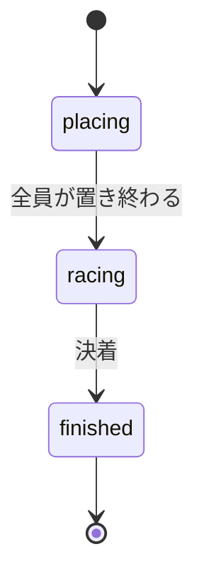

# プロジェクト用語集 (Glossary)

## 概要

このドキュメントは、レーストラック(ブラウザ版)のドキュメントとコードで使う用語を定義する。ドキュメントでは日本語の用語を、コードでは「英語表記(コード上の名前)」を使い、両者の対応をここで固定する。

**更新日**: 2026-09-27

**使わない用語**:

| 用語 | 理由 | 代わりに使う用語 |
|------|------|-----------------|
| スピン | 検討の途中で廃止したルール。行ける点がないときは、止まって再スタートせず、負けになる | 行き止まり |
| 失格 | 選べない点ははじめから選べないため、失格は起こらない | (なし) |
| アシスト | P1の機能名を変更した | 行き止まりのアラート |

## ドメイン用語

ゲームのルールと遊び方に関する用語。ルールの正式な定義は `docs/product-requirements.md` の「ゲームのルール」にある。

### 盤とコース

#### 格子点

**定義**: 方眼の線の交点。車は格子点の上だけを動く。

**説明**: 座標は整数の `(x, y)` で表す。x は右向き、y は下向き(画面の「上」は y が減る向き)。盤の格子点は 0〜32(33×33)。

**関連用語**: 位置・速度・加速

**英語表記**: grid point(コードでは `Vec`)

#### コース

**定義**: 盤の上に描かれた、車が走る道。片方の端がスタートライン、もう片方の端がゴールライン。

**説明**: 中心線の折れ線、角を丸める円弧の半径(フィレット半径)、道の半幅で定義する。最初の版には次の3コースがある。

| コース | コースID | 難易度 | 難易度のコード上の名前 |
|--------|---------|--------|----------------------|
| ヘアピン | `hairpin` | やさしい | `easy` |
| クランク | `crank` | ふつう | `normal` |
| うずまき | `spiral` | むずかしい | `hard` |

注意: コースの難易度「ふつう」(`Difficulty` の `'normal'`)と、CPUの強さ「ふつう」(`CpuLevel` の `'normal'`)は、同じ言葉・同じ値だが別の型。文章では「難易度ふつう」「強さふつう」のように区別する。

**関連用語**: 芝、中心線・パス、半幅、スタートライン・ゴールライン、CPUの強さ

**英語表記**: course(コース定義は `CourseDefinition`、判定用に組み立てたものは `Course`)

#### 芝

**定義**: 盤のうち、コースの外側の部分。

**説明**: 黄緑で描く。車は芝の上に止まれず、芝の上を通る線分も引けない。コースの別々の部分の間には、2目盛り以上の芝がある。

**関連用語**: コース、中心線・パス

**英語表記**: grass

#### 中心線・パス

**定義**: 中心線は、コースの中央を通る折れ線。パスは、中心線の角をフィレット(円弧)で丸めて、直線と円弧の列にしたもの。

**説明**: コースの内側とは、パスからの距離が半幅以下の範囲(スタートラインの後ろとゴールラインの先は平らに切り落とす)。縁の上は内側に含める。

**関連用語**: コース、半幅、芝

**英語表記**: centerline / path(`PathElement`)

#### 半幅

**定義**: 中心線から道の縁までの距離(目盛り)。道幅は半幅の2倍。

**関連用語**: 中心線・パス

**英語表記**: half width(`halfWidth`)

#### スタートライン・ゴールライン

**定義**: コースの両端で、中心線に直交する長さ「半幅×2」の線分。

**説明**: スタートライン上の格子点がスタート位置の候補になる。ゴールラインは、1手の線分がそこに到達または通過するとゴールになる線。

**関連用語**: スタート位置、ゴール

**英語表記**: start line(`startLine`)/ goal line(`goalLine`)

#### スタート位置

**定義**: レースの前に、手番順に選んで車を置く、スタートライン上の格子点。

**説明**: 相手の車がある点は選べない。CPUは最短手数の表を使って選ぶ。

**関連用語**: スタートライン・ゴールライン、先攻・後攻、最短手数

**英語表記**: start point(`startPoints`)

### 車の動き

#### 位置・速度・加速

**定義**:
- **位置**: 車がいる格子点
- **速度**: 前の手の移動量(縦・横の目盛り数)。はじめは `(0, 0)`
- **加速**: 前の手の移動量からの変化。縦・横それぞれ −1・0・+1 のどれか

**説明**: 1手で、行き先 = 位置 + 速度 + 加速、新しい速度 = 速度 + 加速 になる。加速の9通りが、9候補と方向パッドの9つのボタンに対応する。盤の大きさから、速度は各成分 −7〜+7 に収まる。

**使用例**:
- 前の手が「右3・上2」なら、速度は `(3, -2)`
- 加速 `(0, 0)` を選ぶと、速度そのままで慣性点に進む

**関連用語**: 慣性点、候補、行き先、方向パッド

**英語表記**: position(`position`)/ velocity(`velocity`)/ acceleration(`accel`)

#### 慣性点

**定義**: 前の手とまったく同じだけ進んだ点。位置 + 速度。

**説明**: 9候補の中心。盤には「+」の印で表示する。

**関連用語**: 候補、加速

**英語表記**: inertia point(`inertiaPoint`)

#### 候補

**定義**: 慣性点を中心とした3×3の9点。次の手で行ける可能性のある点。

**説明**: 手番のたびに、9点それぞれを次の4種類に分類する。

| 分類 | 意味 | 選べるか | コード上の名前 |
|------|------|----------|---------------|
| 選べる | コースの内側で、相手の車もいない | できる | `ok` |
| ゴールできる | 線分がゴールラインに到達・通過する | できる | `goal` |
| はみ出す | 行き先の点か線分がコースの外に出る | できない | `offCourse` |
| 相手がいる | 相手の車が今いる点 | できない | `occupied` |

**関連用語**: 慣性点、行き先、行き止まり、危ない手

**英語表記**: candidate(`Candidate`)

#### 行き先

**定義**: 候補の1つを選んだときに車が移る格子点。位置 + 速度 + 加速。

**関連用語**: 候補、位置・速度・加速

**英語表記**: target(`target`)

#### 手

**定義**: 加速を1つ選んで車を行き先へ進め、元の点と線で結ぶ1回の動作。

**説明**: スタート位置に車を置く動作は手に含めない。

**関連用語**: 手番、手数、行動

**英語表記**: move(行動としては `{ type: 'move', accel }`)

#### とどまる手

**定義**: 速度0のときに、加速 `(0, 0)` を選んでその場にとどまる手。

**説明**: ルールで認めている。これにより、速度0のときは行き止まりにならない。続けることにも制限はない。

**関連用語**: 位置・速度・加速、行き止まり

**英語表記**: stay move

#### 衝突禁止

**定義**: 相手の車が今いる点には止まれないというルール。

**説明**: 禁止は「同時に同じ点にいる」ことだけ。線どうしの交差や、相手が以前いた点に止まるのは許される。ゴールした車は盤から外れたものとして扱う。

**関連用語**: 候補(相手がいる)、ゴール

**英語表記**: no collision

### 手番と勝敗

#### 先攻・後攻

**定義**: 先攻は各周回で先に指すプレイヤー、後攻は後に指すプレイヤー。

**説明**: 先攻は赤鉛筆、後攻は青鉛筆の色で表示する。CPU戦では「くじ」「先攻」「後攻」から選び、人同士の対戦ではくじを行わず赤鉛筆が先攻になる。

**関連用語**: 周回、同着ルール、くじ

**英語表記**: first player / second player(`players[0]` が先攻)

#### 手番

**定義**: 今、手を指す番のプレイヤー。

**関連用語**: 先攻・後攻、周回

**英語表記**: turn(`turn` は手番のプレイヤーの番号)

#### 周回

**定義**: 先攻の手と、それに続く後攻の手を合わせた1区切り。

**説明**: 同着ルールの判定に使う。レース中は現在の周回数を表示する。

**関連用語**: 手番、同着ルール

**英語表記**: round(`round`、1から数える)

#### 手数

**定義**: スタート位置を置いた後に指した手の数。

**説明**: 結果画面に表示する。同じ周回でゴールした2人の手数は同じになる。

**関連用語**: 手、周回

**英語表記**: move count(1人分は `trail.length - 1`、全員分は `GameResult.moveCounts`)

#### ゴール

**定義**: 1手の線分がゴールラインに到達または通過すること。ゴールライン上にぴったり止まった場合も含む。

**説明**: ゴールする手に限り、線分がゴールラインの先(コースの外)に出てもよい。ただし、ゴールラインに届くまでの部分はコースの内側でなければならない。

**関連用語**: スタートライン・ゴールライン、同着ルール

**英語表記**: goal(`GoalCrossing`、`goalRound`)

#### 同着ルール

**定義**: 同じ周回で両者がゴールした場合は後攻の勝ちとするルール。

**説明**: 記事では先に通過した先攻の勝ちだが、このゲームで変更した。そのため、先攻がゴールしても、その周回の後攻の手番まで決着しない。

**関連用語**: 周回、先攻・後攻、決着の理由

**英語表記**: tie rule(`tieRule`)

#### 行き止まり

**定義**: 自分の手番で、9候補がすべて選べない状態。行き止まりになったプレイヤーの負け。

**説明**: 理由がコースの外でも、相手の車に塞がれている場合でも負けになる。9候補がすべてコースの外になる点に移動したときは、その場で「次の手番では、どこにも進めません」と予告する(相手の車が理由の場合は予告しない)。

**関連用語**: 行き止まりの予告、危ない手

**英語表記**: dead end(`deadEnd`、予告の判定は `willBeDeadEnd`)

#### 決着の理由

**定義**: 結果画面に表示する、勝敗が決まった理由。

| 理由 | 意味 | コード上の名前 |
|------|------|---------------|
| ゴール | 先にゴールした | `goal` |
| 同着ルール | 同じ周回で両者がゴールし、後攻の勝ち | `tieRule` |
| 行き止まり | 相手が行き止まりになった | `deadEnd` |

**関連用語**: ゴール、同着ルール、行き止まり

**英語表記**: result reason(`ResultReason`)

### CPUと補助機能

#### 最短手数

**定義**: ある状態(位置と速度)から手番を始めたとき、相手の車がない前提で、ゴールまでに必要な最小の手数。

**説明**: ゴールできない状態(この先どう指しても行き止まりになる状態)の最短手数は「なし」とする。

**関連用語**: 最短手数の表、状態、損、危ない手

**英語表記**: distance(「なし」はコードでは `null`)

#### 最短手数の表

**定義**: コースごとに、すべての状態の最短手数を並べた表。

**説明**: ビルド時に生成して同梱し、ブラウザでは読み込むだけにする。CPUの手の選択と、行き止まりのアラートに使う。

**関連用語**: 最短手数、状態、ビルド時の表の生成

**英語表記**: distance table(`DistanceTable`)

#### 状態

**定義**: 最短手数の表の見出しになる、位置と速度の組み合わせ `(位置, 速度)`。

**説明**: ゲーム全体の状態(`GameState`)とは別物。文脈で紛らわしいときは「表の状態」と書く。

**関連用語**: 最短手数の表、位置・速度・加速

**英語表記**: state(表の文脈)

#### CPUの強さ

**定義**: CPUがわざと損する手を混ぜる度合い。3段階。

| 強さ | わざと損する確率 | 損の上限 | コード上の名前 |
|------|------------------|----------|---------------|
| よわい | 0.5 | 3手 | `weak` |
| ふつう | 0.2 | 1手 | `normal` |
| つよい | 0 | 0 | `strong` |

**説明**: 確率と損の上限は初期値で、プレイテストで調整する。どの強さでも、ゴールできればゴールし、避けられる限り最短手数が「なし」の手は選ばない。

**関連用語**: 損、最短手数、コース(難易度との区別)

**英語表記**: CPU level(`CpuLevel`)

#### 損

**定義**: ある手を選んだときの最短手数と、選べる手の中で最も小さい最短手数との差。

**関連用語**: CPUの強さ、最短手数

**英語表記**: loss

#### 危ない手・行き止まりのアラート(P1)

**定義**: 危ない手は、選ぶとこの先どう指しても行き止まりになる候補(行き先の最短手数が「なし」)。行き止まりのアラートは、危ない手をオレンジ色で示し、選んだときに確定前の確認を出す機能。

**説明**: 相手の車は考えない。危ない手も選択はできる。

**関連用語**: 行き止まり、最短手数、候補

**英語表記**: dangerous candidate(`dangerous`)/ dead-end alert(設定の `alert`)

#### 1手戻す(待った)(P1)

**定義**: 直前の手を取り消す機能。CPU戦では、人の直前の1手とCPUの応手をまとめて戻す。

**関連用語**: 手、イミュータブル

**英語表記**: undo

### 画面と操作

| 用語 | 定義 | 英語表記 |
|------|------|---------|
| 赤鉛筆・青鉛筆 | 先攻・後攻の車と軌跡の色 | `PenColor`(`'red'`・`'blue'`) |
| 軌跡 | 車が通った点を順に結んだ線 | trail(`trail`) |
| 方向パッド | 加速を選ぶ3×3のボタン。中央は「そのまま」 | direction pad(`DirectionPad`) |
| プレビュー | 候補を仮に選んだ状態。行き先までの線分を破線で表示する | preview |
| 確定 | 候補を選んで手を指すこと。マウスは1回、タッチと方向パッドは2回の操作で確定する | confirm |
| くじ | CPU戦で先攻後攻を無作為に決めること | lottery(`'lottery'`) |
| 決定ボタン | スタート位置選びで、「←」「→」ボタンで選んだ点を確定するボタン | confirm button |
| ルール説明 | 設定画面・レース中に開ける、ゲームのルールの説明 | rules(`RulesDialog`) |
| 手数番号(P1) | 軌跡の各点に表示する手数の番号 | move number |
| 拡大表示(P1) | 手番の車を中心に盤を拡大するスマホ向けの表示 | zoom view |
| コースの準備 | 設定画面で「スタート」を押した後、選んだコースの最短手数の表を読み込む段階 | course preparation |
| 考え中 | CPUの手番で、手を指す前に表示する演出(時間は PRD の非機能要件) | thinking |

## 技術用語

| 技術 | 定義 | 本プロジェクトでの用途 | バージョン |
|------|------|-----------------------|-----------|
| Node.js | サーバーや開発ツールで使う JavaScript の実行環境 | 開発時のビルド・テスト・表の生成(遊ぶときには使わない) | v24 LTS |
| npm | Node.js に同梱のパッケージ管理ツール | 依存の管理とスクリプトの実行 | 11.x |
| TypeScript | 型のある JavaScript | すべてのソースコード | 5.9.x |
| SVG | 図形を記述するXMLベースの画像形式 | 盤の描画 | — |
| Vite | 開発サーバーとビルドツール | 開発サーバー、`dist/` の出力 | 8.x |
| tsx | TypeScript をそのまま Node.js で実行するツール | 最短手数の表の生成スクリプト | 最新安定版 |
| Vitest | テストフレームワーク | ユニットテスト、コースの自動チェック、シミュレーション | 5.x |
| Playwright | ブラウザ自動操作によるテストツール | E2Eテスト(Chromium・WebKit) | 1.63.x |
| ESLint / Prettier | 静的解析 / 整形ツール | コードの品質と層の依存ルールの強制 / 整形 | 9.x / 3.x |
| husky / lint-staged | Git フックの管理 / 変更ファイルへのコマンド実行 | コミット前のチェック | 9.x / 15.x |
| itch.io | インディーゲームの公開サイト | ゲームの公開先(HTML5ゲームとしてzipをアップロード) | — |
| butler | itch.io 公式のアップロードツール | 将来のアップロードの自動化(検討中) | — |
| GitHub Actions | GitHub のCIサービス | lint・型チェック・テスト・ビルドの自動実行 | — |
| Web Worker | ブラウザで計算を画面の処理と別に動かす仕組み | 将来(P2)、固定でないコースの表をブラウザで計算するとき | — |
| DecompressionStream | gzip などで圧縮されたデータを展開する、ブラウザ標準の仕組み | 圧縮して同梱した最短手数の表の展開 | — |

詳細は `docs/architecture.md` の「テクノロジースタック」を参照。

## 略語・頭字語

| 略語 | 正式名称 | 意味・本プロジェクトでの使用 |
|------|----------|------------------------------|
| PRD | Product Requirements Document | プロダクト要求定義書(`docs/product-requirements.md`) |
| MVP | Minimum Viable Product | 最初の版。優先度P0の機能 |
| P0・P1・P2 | Priority 0・1・2 | 機能の優先度。P0は最初の版、P1は初期リリース後すぐ、P2は将来 |
| KPI | Key Performance Indicator | 成功指標。自動テストとプレイテストで測る |
| CPU | Central Processing Unit | このプロジェクトでは、コンピューターが操作する対戦相手を指す |
| E2E | End to End | 画面を実際に操作して一連の流れを確かめるテスト |
| CI | Continuous Integration | push ごとの自動チェック(GitHub Actions) |
| PR | Pull Request | 作業ブランチを `main` にマージするための依頼。このプロジェクトでは使わず、手元でマージして push する |
| DOM | Document Object Model | ブラウザの画面の要素を扱う仕組み |
| fps | frames per second | アニメーションの1秒あたりのコマ数(目標60) |

## アーキテクチャ用語

### 層(UI層・アプリケーション層・ドメイン層)

**定義**: ソースコードを責務で分けた3つの層。UI層(画面と入力)、アプリケーション層(画面の流れと手番の進行)、ドメイン層(ルール・判定・CPU)。依存は UI層 → アプリケーション層 → ドメイン層 の一方向。

**本プロジェクトでの適用**: 各層の責務、ディレクトリ、依存のルールは `docs/architecture.md` の「アーキテクチャパターン」を正とする。

### 行動

**定義**: ドメイン層に渡す、ゲームを1歩進める指示。「スタート位置に置く」と「加速を選んで進む」の2種類。

**本プロジェクトでの適用**: 画面の操作もCPUの手も行動に変換してから適用する。座標だけの小さな値なので、将来のオンライン対戦ではそのまま送る。

**英語表記**: action(`Action`)

### イミュータブル

**定義**: 一度作った値を書き換えないこと。

**本プロジェクトでの適用**: `GameState` は書き換えず、行動を適用するたびに新しい状態を作る。P1の「1手戻す」は、状態を履歴に積むだけで実現する。

### 純粋関数

**定義**: 同じ引数には必ず同じ結果を返し、引数や外の状態を書き換えない関数。

**本プロジェクトでの適用**: ドメイン層の関数はすべて純粋関数にする。乱数は `Random` インターフェースで引数として受け取る。

### 後ろ向き幅優先探索

**定義**: ゴールできる状態から出発し、1手前の状態へ逆向きにたどりながら、近い順に最短手数を決めていく探索。

**本プロジェクトでの適用**: 最短手数の表の生成(`buildDistanceTable`)。状態 `(p, v)` の1手前の状態は、`(p − v, v − 加速)` の9つ。

### 標本化・距離による省略

**定義**: 標本化は、線分の上に一定間隔で点を取り、それぞれを調べること。距離による省略は、点の中心線からの距離を使って、調べなくても内側と確定できる部分を飛ばすこと。

**本プロジェクトでの適用**: 線分の内外判定。標本化の間隔は1/16目盛りで、見た目とのずれは最大1/32目盛り。線分を二分割しながら、確定できない部分だけを調べる。

### ビルド時の表の生成

**定義**: `npm run build`・`npm run dev` の前に、最短手数の表を計算してファイルに書き出すこと。

**本プロジェクトでの適用**: `scripts/generate-tables.ts` が、gzip で圧縮した `public/tables/[コースID].bin.gz` を作る。生成物は Git で管理しない。

### ステアリング

**定義**: 作業ごとに「今回何をするか」を書く文書のまとまり。

**本プロジェクトでの適用**: `.steering/[YYYYMMDD]-[作業名]/` に `requirements.md`・`design.md`・`tasklist.md` を置く。1つのステアリングに1つの作業ブランチを対応させる。

## ステータス・状態

### ゲームの段階

| 段階 | 意味 | 遷移条件 | 次の段階 |
|------|------|---------|---------|
| `placing` | スタート位置選び | 全員がスタート位置に置く | `racing` |
| `racing` | レース中 | ゴール・同着ルール・行き止まりで決着する | `finished` |
| `finished` | 決着 | —(「もう一度」で新しいゲームを作る) | — |

**状態遷移図**:


**英語表記**: game phase(`GamePhase`)

### 画面

| 画面 | 意味 |
|------|------|
| 設定 | 対戦相手・コース・CPUの強さ・先攻後攻を選ぶ |
| コースの準備 | 最短手数の表を読み込む |
| くじ | CPU戦で「くじ」を選んだときに、結果を表示する |
| スタート位置選び | 手番順にスタート位置を選ぶ(`placing`) |
| レース | 交互に手を指す(`racing`) |
| 結果 | 勝者・決着の理由・手数を表示する(`finished`) |

画面の遷移は `docs/functional-design.md` の「画面遷移図」を参照。

## データモデル用語

| 型 | 定義 | 主なフィールド | 定義場所 |
|----|------|---------------|---------|
| `Vec` | 格子点、または移動量・速度・加速(`Point` と同じ形で、整数だけを入れる) | `x`(右が正)、`y`(下が正) | `src/domain/types.ts` |
| `Point` | 盤上の座標(実数) | `x`(右が正)、`y`(下が正) | `src/domain/types.ts` |
| `Segment` | 盤上の線分 | `from`、`to`(`Point`) | `src/domain/types.ts` |
| `CourseDefinition` | コースの定義データ | `centerline`、`filletRadius`、`halfWidth`、`boardSize` | `src/domain/course/types.ts` |
| `Course` | 判定用に組み立てたコース | `path`、`startLine`、`goalLine`、`startPoints` | `src/domain/course/types.ts` |
| `GameSettings` | 設定画面で選んだ内容 | `opponent`、`courseId`、`cpuLevel`、`turnOrder`、`alert` | `src/domain/types.ts` |
| `GameState` | ゲーム全体の状態 | `players`、`phase`、`turn`、`round`、`result` | `src/domain/types.ts` |
| `PlayerState` | 1人のプレイヤーの状態 | `kind`、`color`、`position`、`velocity`、`trail`、`goalRound` | `src/domain/types.ts` |
| `Action` | 行動 | `type`(`'place'`・`'move'`)、`point` または `accel` | `src/domain/types.ts` |
| `Candidate` | 候補 | `accel`、`target`、`status`、`goal`、`dangerous` | `src/domain/types.ts` |
| `GameResult` | 結果 | `winner`、`reason`、`moveCounts` | `src/domain/types.ts` |
| `DistanceTable` | 最短手数の表 | `get(position, velocity)` | `src/domain/table/` |

各フィールドの意味は `docs/functional-design.md` の「データモデル定義」を参照。

## エラー・例外

### ルール違反のエラー

**クラス名**: `RuleViolationError`

**発生条件**: ルールに合わない行動を適用しようとしたとき(選べない候補、置けないスタート位置、手番でないプレイヤーの行動)。

**対処方法**: 画面側で選べない操作は無効化しているので、通常は起こらない。起きた場合は不具合として、行動の内容をコンソールに記録する。将来のオンライン対戦では、相手から届いた不正な行動を拒否するのにも使う。

**例**:
```typescript
throw new RuleViolationError('その候補はコースの外です', action);
```

### コース定義のエラー

**クラス名**: `CourseDefinitionError`

**発生条件**: コース定義が、機能設計書の `CourseDefinition` の制約を満たさないとき(`buildCourse` の最初に検証する)。

**対処方法**: コース定義を直す。本番の3コースは自動テストで検証するので、公開前に見つかる。

**例**:
```typescript
throw new CourseDefinitionError('crank', '最初の辺が軸に平行ではありません');
```

### 表の読み込みエラー

**発生条件**: 最短手数の表のファイルが読み込めない、またはサイズがコースから計算したサイズと一致しないとき。

**対処方法**: 「エラーが起きました。設定画面に戻ります」と表示して設定画面に戻る。開発者は、ビルド時に表が生成されているかを確認する。

## 計算・アルゴリズム

### 行き先と慣性点

**計算式**:
```
慣性点     = 位置 + 速度
行き先     = 位置 + 速度 + 加速      (加速の各成分は -1, 0, +1)
新しい速度 = 速度 + 加速
```

**実装箇所**: `src/domain/rules/listCandidates.ts`、`src/domain/rules/applyAction.ts`

**例**:
```
入力: 位置 (10, 20)、速度 (3, -2)、加速 (1, 0)
出力: 慣性点 (13, 18)、行き先 (14, 18)、新しい速度 (4, -2)
```

### 速度の範囲

**定義**: 盤の中で出せる速度の各成分の上限。

**計算式**:
```
k(k + 1) / 2 ≤ N − 1 を満たす最大の k   (N は盤の1辺の格子点の数)
```

**実装箇所**: `src/domain/table/speedRange.ts`

**例**:
```
入力: N = 33(格子点 0〜32)
出力: k = 7(1 + 2 + … + 7 = 28 ≤ 32、1 + 2 + … + 8 = 36 > 32)
```

### 1手前の状態

**定義**: 後ろ向き幅優先探索で、状態 `(p, v)` に1手で来られる状態。

**計算式**:
```
1手前の状態 = (p − v, v − 加速)    (加速の9通り)
条件: p − v がコースの内側で、線分 p − v → p がコースの内側
```

**実装箇所**: `src/domain/table/buildDistanceTable.ts`
